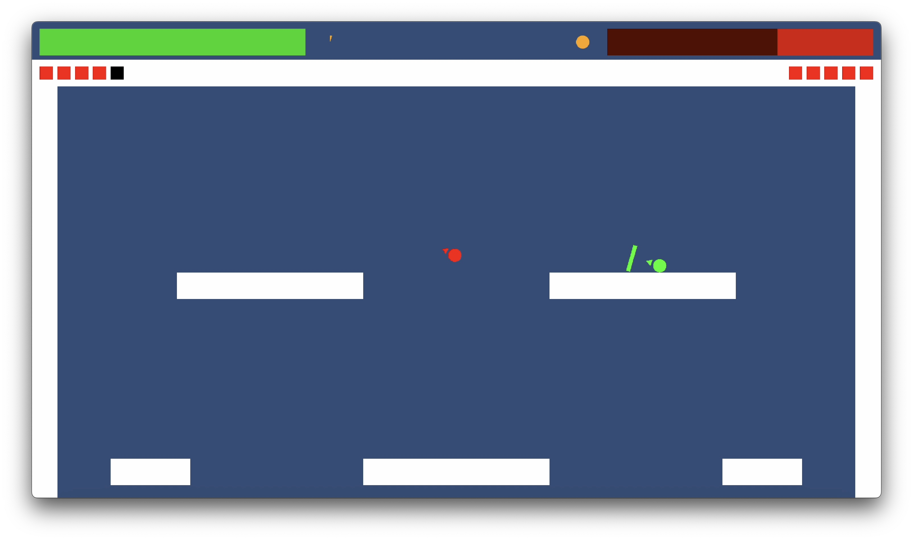

# Fighting Game
A fast-paced 1v1 fighting game prototype focused on timing and mobility. Requires controllers to play.

## Unity Play
Due to the nature of WebGL builds, some browsers may not allow two players, full screen, and controls may be slow to respond.  
[Play on Unity Play.](https://play.unity.com/en/games/0a20bda9-7019-4665-8d61-31d944f3dfd6/fighting-game-prototype)

## Screenshots
#### Video
[Watch video here](https://github.com/CadenLau/Fighting-Game/raw/main/gameplay/game.mp4)
#### Gameplay

## Requirements
- Unity 6.0 LTS
- Two controllers (Xbox or compatible)

## Installation (Unity Editor)
### 1. Clone the repository
    git clone https://github.com/CadenLau/Fighting-Game.git
### 2. Open in Unity
1. Open Unity Hub.
2. Click Add -> Add project from disk.
3. Select the cloned project folder.
4. Open the project using Unity 6.0 LTS.

## Running the Game in Unity
Open the main scene and press play.

## Usage
### Controls
| Key | Action |
| ----------- | ----------- |
| Left Bumper | Dash |
| Left Trigger | Dodge |
| Right Bumper | Melee |
| Right Trigger | Shoot |
| Left Stick | Move |
| Right Stick | Aim |
| Button South | Special |
| Start | Restart game (at round end) |

## Features
- 1v1 local multiplayer
- Fighting game with emphasis on timing
- High mobility movement system
- Simple visuals to maximize gameplay readability

## Future Goals
- Further emphasize aerial movement and dash timing
- Continue tuning game to encourage aggression over defensive play
- Add multiple characters with different specials and distinct movement
- Implement a pause menu with controller configuration
- Explore adding a radial gravity stage

## Project Structure
    ├── Assets/
    |   ├── Prefabs/
    |   ├── Scenes/
    |   ├── Scripts/
    |   ├── Settings/
    |   └── TextMesh Pro/
    ├── gameplay/
    ├── Packages/
    ├── ProjectSettings/
    ├── LICENSE.txt
    ├── .gitignore
    └── README.md

## Built With
- Unity 6.0 LTS

## License
This project is licensed under the Creative Commons Attribution–NonCommercial–ShareAlike 4.0 International License (CC BY-NC-SA 4.0).

You are free to play, share, and modify this project for non-commercial purposes, with appropriate attribution.

See [`LICENSE`](LICENSE.txt) file for details.
